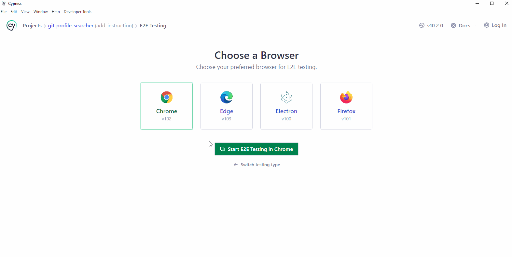
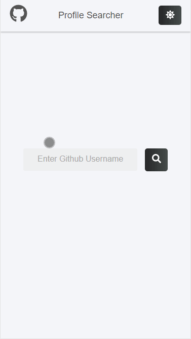

# git-profile-searcher
## Author
<h1>Petar Vasic</h1>

## Description
This product has two pages which is fully responsive for various kinds of devices. \
After run the project, you can see `Search Page` first. \
Here you can see the `search input` and `Search` button which can be typed with a github username. \
Once you input an username, regardless of whatever it is, the site will go to `Profile Page` where you can see the information of the user. \
When you want to go back to `Search Page`, just click `Logo`. \
At right corner, you can see `Light/Dark mode` toggle button so that it's possible to change the theme mode.

## Node Version
v14.19.0

## Tech stacks

 \
It's built by CRA from scratch using `npx create-react-app xxx --template typescript`. \
To enhance styling for reactjs components, I chose `styled-components`. \
To integrate with api endpoints, I chose `axios`. \
To do e2e tests, I chose `cypress`.

## Scripts
* ### npm start
   It will run the project in development mode and automatically open `http://localhost:3000` in your browser.
* ### npm build
   It will build your project using webpack.
* ### npm test
   Before running test, you must run `npm start` so that cypress can access to `http://localhost:3000`. \
   If you run the product on the other port, then you have to change `baseUrl` configuration of `cypress.config.ts`. \
   You can see cypress window where you can run unit testing files and e2e testing files.
   

      
   

## Demo screen

    

## Licence
Copyright (c) 2022 Petar Vasic